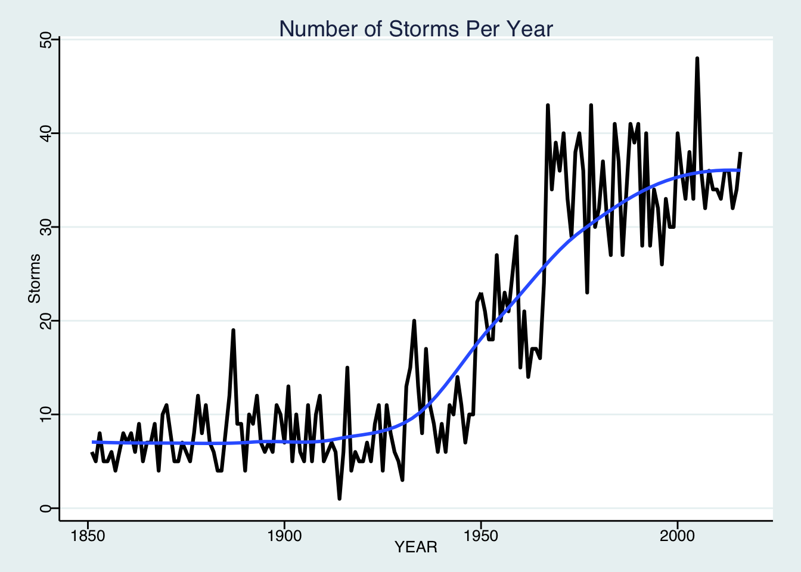
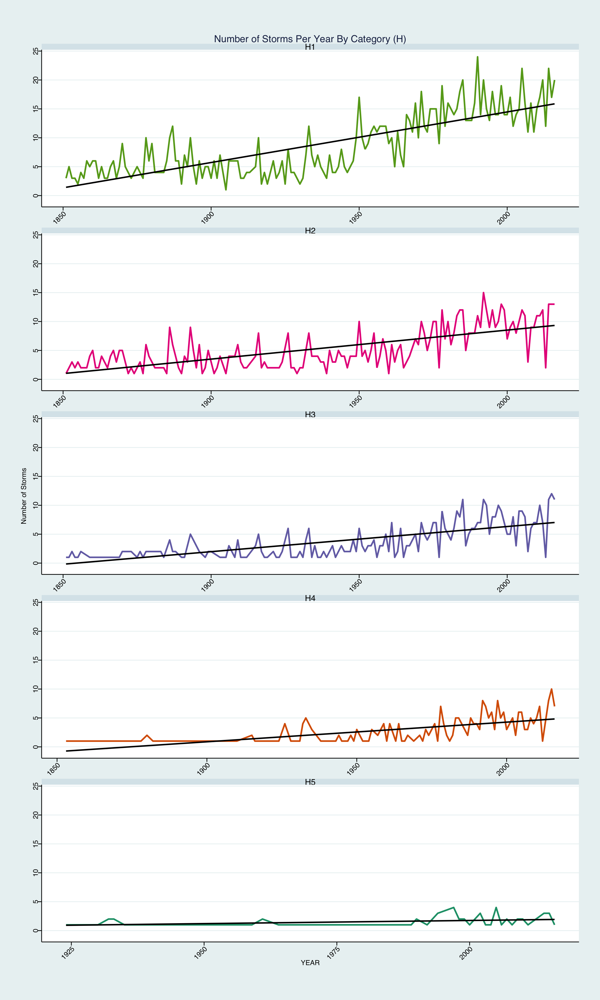

Analysis of Hurricane data from HURDAT package
----------------------------------------------

    #libraries
    library(tidyverse)

    ## ── Attaching packages ──────────────────────────────────────────────────────────── tidyverse 1.2.1 ──

    ## ✔ ggplot2 2.2.1     ✔ purrr   0.2.4
    ## ✔ tibble  1.3.4     ✔ dplyr   0.7.4
    ## ✔ tidyr   0.7.2     ✔ stringr 1.2.0
    ## ✔ readr   1.1.1     ✔ forcats 0.2.0

    ## ── Conflicts ─────────────────────────────────────────────────────────────── tidyverse_conflicts() ──
    ## ✖ dplyr::filter() masks stats::filter()
    ## ✖ dplyr::lag()    masks stats::lag()

    library(ggthemes)
    library(ggmap)
    library(htmlwidgets)
    library(gridExtra)

    ## 
    ## Attaching package: 'gridExtra'

    ## The following object is masked from 'package:dplyr':
    ## 
    ##     combine

    library(HURDAT)
    library(lubridate)

    ## 
    ## Attaching package: 'lubridate'

    ## The following object is masked from 'package:base':
    ## 
    ##     date

    source("classifiy_hurricianes.R")

Read Inital and Save Data
-------------------------

The data span the time from 1851 to 2016. We will have almost 80k
observations with 24 variables. It will take a while to read the inital
data with get\_hurdat function. Therefore I will save the data for more
easy access in the future. If you run this code the first time please
uncomment the lines with "get\_hurdat" and "saveRDS".

    #data <- get_hurdat(basin = c("AL", "EP"))
    #saveRDS(data, "data/hurricanesALEP")
    data <- readRDS("data/hurricanesALEP")

Manage the dates
----------------

    data$YEAR <- year(data$DateTime)
    data$MONTH <- month(data$DateTime)
    data$DAY <- day(data$DateTime)
    summary(data %>% select(YEAR, MONTH, DAY, Wind, Pressure))

    ##       YEAR          MONTH             DAY             Wind       
    ##  Min.   :1851   Min.   : 1.000   Min.   : 1.00   Min.   : 10.00  
    ##  1st Qu.:1939   1st Qu.: 8.000   1st Qu.: 8.00   1st Qu.: 30.00  
    ##  Median :1975   Median : 9.000   Median :16.00   Median : 45.00  
    ##  Mean   :1964   Mean   : 8.517   Mean   :15.86   Mean   : 51.57  
    ##  3rd Qu.:1997   3rd Qu.: 9.000   3rd Qu.:23.00   3rd Qu.: 65.00  
    ##  Max.   :2016   Max.   :12.000   Max.   :31.00   Max.   :185.00  
    ##                                                  NA's   :338     
    ##     Pressure     
    ##  Min.   : 872.0  
    ##  1st Qu.: 986.0  
    ##  Median :1000.0  
    ##  Mean   : 993.5  
    ##  3rd Qu.:1007.0  
    ##  Max.   :1024.0  
    ##  NA's   :43473

First plot to get an overview of the data
-----------------------------------------

    # first plot
    df = data %>%
      group_by(YEAR) %>%
      summarise(Distinct_Storms = n_distinct(Key))

    p = ggplot(df, aes(x = YEAR, y = Distinct_Storms)) + theme_stata()
    p + geom_line(size = 1.1) + 
      ggtitle("Number of Storms Per Year") + 
      theme(plot.title = element_text(hjust = 0.5)) +
      geom_smooth(method='lm', se = FALSE) + 
      ylab("Storms")

Categorize storms
-----------------

Create a new variable which classifies the hurricanes according to
windspeed.

    data$CATEGORY <- sapply(data$Wind, classifyHurricane)

Plot the storms by category
---------------------------

    #by category
    df = data %>%
      filter(grepl("H", CATEGORY)) %>%
      group_by(YEAR,CATEGORY) %>%
      summarise(Distinct_Storms = n_distinct(Key))
    df$CATEGORY = factor(df$CATEGORY)

    p = ggplot(df, aes(x = YEAR, y = Distinct_Storms, col = CATEGORY)) + theme_stata()
    p + geom_line(size = 1.1) + 
      scale_color_brewer(direction = -1, palette = "Dark2") + 
      ggtitle("Number of Storms Per Year By Category (H)") + 
      theme(plot.title = element_text(hjust = 0.5)) +
      facet_wrap(~ CATEGORY, scales = "free_x", ncol = 1) + 
      geom_smooth(method = 'lm', se = FALSE, col = 'black') +
      theme(axis.text.x = element_text(hjust = 1, angle=45), legend.position = 'none') + 
      ylab('Number of Storms') +
      theme(axis.title.y = element_text(margin = margin(t = 0, r = 10, b = 0, l = 0)))

 \#\# Make a distinct
dataset I also will filter the data. A hurricane in its lifecycle will
go through several stages, from tropical storm to a class H1 hurricane
to H2 to H1, tropical storm. I want to count each storm only once with
its highest ratings. On my laptop this takes a while, so again, I will
save the data for further analysis. This will show us, that in the time
frame from 1851 to 2016 a total of 2900 storms have been recorded. If
you run this code the first time please uncomment the lines with
"highestClassification4Storm" and "saveRDS".

    #distinctStormData <- highestClassification4Storm(data)
    #saveRDS(distinctStormData, "data/hurricanesALEPAAA")
    distinctStormData <- readRDS("data/hurricanesALEPAAA")
    summary(distinctStormData)

    ##      Key                 YEAR        CATEGORY              Wind       
    ##  Length:2900        Min.   :1851   Length:2900        Min.   :  0.00  
    ##  Class :character   1st Qu.:1942   Class :character   1st Qu.: 45.00  
    ##  Mode  :character   Median :1974   Mode  :character   Median : 60.00  
    ##                     Mean   :1963                      Mean   : 67.45  
    ##                     3rd Qu.:1996                      3rd Qu.: 90.00  
    ##                     Max.   :2016                      Max.   :185.00

Plot all distinct storms
------------------------

    df = distinctStormData %>%
      group_by(YEAR) %>%
      summarise(Distinct_Storms = n_distinct(Key))

    p = ggplot(df, aes(x = YEAR, y = Distinct_Storms)) + theme_stata()
    p + geom_line(size = 1.1) + 
      ggtitle("Number of distinct Storms Per Year") + 
      theme(plot.title = element_text(hjust = 0.5)) +
      geom_smooth(method='lm', se = FALSE) + 
      ylab('Number of Storms') +
      theme(axis.title.y = element_text(margin = margin(t = 0, r = 10, b = 0, l = 0)))

 \#\# Plot disitinct
hurricanes by category

    df = distinctStormData %>%
      filter(grepl("H", CATEGORY)) %>%
      group_by(YEAR,CATEGORY) %>%
      summarise(Distinct_Storms = n_distinct(Key))
    df$CATEGORY = factor(df$CATEGORY)

    p = ggplot(df, aes(x = YEAR, y = Distinct_Storms, col = CATEGORY)) + theme_stata()
    p + geom_line(size = 1.1) + 
      scale_color_brewer(direction = -1, palette = "Dark2") + 
      ggtitle("Number ofd disitinct Storms Per Year By Category (H)") + 
      theme(plot.title = element_text(hjust = 0.5)) +
      facet_wrap(~CATEGORY, scales = "free_x", ncol = 1) + 
      geom_smooth(method = 'lm', se = FALSE, col = 'black') +
      theme(axis.text.x = element_text(angle=45), legend.position = 'none') + 
      ylab('Number of Storms') +
      theme(axis.title.y = element_text(margin = margin(t = 0, r = 10, b = 0, l = 0)))

